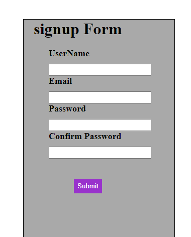

# 
 **Javascript Projects** 

>In this repository, I will update all the projects I have done and will be doing in future on Javascript. I will update this repository as soon as I make a new project. Here are the list of projects: 

## **1. Age Calculator:** 
This web application can calculates your age accurately in Years Months and Days by getting your date of birth.

**Screenshot:** 

**Source Code:** [Here](https://github.com/Shubham432000/Javascript-Assignment/tree/master/Age-Calculator)

**Live link:** [Here](https://charming-haupia-75fa83.netlify.app) 

## **2. Budget-App:**
This simple project of How Calculate The Budget

**Screenshot:** 

**Source Code:** [Here](https://github.com/Shubham432000/Javascript-Assignment/tree/master/Budget-App)

**Live link:** [Here](https://jovial-belekoy-da5d48.netlify.app/) 

## **3. Calculator:**
This simple project of calculator

**Screenshot:** 

**Source Code:** [Here](https://github.com/Shubham432000/Javascript-Assignment/tree/master/Calculator)

**Live link:** [Here](https://gentle-caramel-fe0eca.netlify.app) 

## **4. Click The Button:**

This simple project counts how many times you have clicked the button.

**Screenshot:** 

**Source Code:** [Here](https://github.com/Shubham432000/Javascript-Assignment/tree/master/Click-the-Button)

**Live link:** [Here](https://prismatic-daffodil-a8f4b8.netlify.app) 

## **5. Conutdown-APP:** 
This is a basic project of how to countdown

**Screenshot:** 

**Source Code:** [Here](https://github.com/Shubham432000/Javascript-Assignment/tree/master/countdown-app)

**Live link:** [Here](https://tourmaline-griffin-13d488.netlify.app)

## **6. Form-Validation:**
This web app shows the outputs of what you type in the input textbox in real time. Itcan also count the total number of words in the input textbox.

This is a basic project form validation of input filed

**Screenshot:** 

**Source Code:** [Here](https://github.com/Shubham432000/Javascript-Assignment/tree/master/Form-validation)

**Live link:** [Here](https://incomparable-elf-4f5b5e.netlify.app)

## **7. Increment-Decrement:** 

In this web app, increase and decrease the app

**Screenshot:** 

**Source Code:** [Here](https://github.com/Shubham432000/Javascript-Assignment/tree/master/Increment-Decrement)

**Live link:** [Here](https://statuesque-beignet-d1e5fe.netlify.app)

## **8. Joke-Generator:** 
In this project, generate the joke through api

**Screenshot:** 

**Source Code:** [Here](https://github.com/Shubham432000/Javascript-Assignment/tree/master/Joke-Generator)

**Live link:** [Here](https://comforting-pudding-ae3cce.netlify.app)

## **9. Loan-Calculator:** 
This web application can calculates the Interest and total

**Screenshot:** 

**Source Code:** [Here](https://github.com/Shubham432000/Javascript-Assignment/tree/master/Loan-Calculator)

**Live link:** [Here](https://dulcet-torte-2528d1.netlify.app)

## **10. Palidrome-Checker-Gamer:** 
This is a classic and very popular game among children. 

**Screenshot:** 

**Source Code:** [Here](https://github.com/Shubham432000/Javascript-Assignment/tree/master/Palindrome-Checker-Game)

**Live link:** [Here](https://leafy-cheesecake-d25ddc.netlify.app)

## **11. See-What-You-type:** 
This is a project what you type this are shown

**Screenshot:** 

**Source Code:** [Here](https://github.com/Shubham432000/Javascript-Assignment/tree/master/See-What-you-type)

**Live link:** [Here](https://voluble-faun-1b3619.netlify.app)

## **12. Stop-watch-App:** 
This is a stop watch app and calculate the time

**Screenshot:** 

**Source Code:** [Here](https://github.com/Shubham432000/Javascript-Assignment/tree/master/StopWatch-app)

**Live link:** [Here](https://stellular-kelpie-719d76.netlify.app)

## **13. TODO-App:** 
This is a TODO app which also has Edit and Delete options on each task.

**Screenshot:** 

**Source Code:** [Here](https://github.com/Shubham432000/Javascript-Assignment/tree/master/To-Do-app)

**Live link:** [Here](https://merry-caramel-de93c0.netlify.app)

## **14.Typing-Game:** 
This app to shows how many character are you type

**Screenshot:** 

**Source Code:** [Here](https://github.com/Shubham432000/Javascript-Assignment/tree/master/Typing-Game)

**Live link:** [Here](https://merry-brioche-30a1ac.netlify.app)

## **15. Word-Cont-App:** 
This is a app to shows the no of character and words

**Screenshot:** 

**Source Code:** [Here](https://github.com/Shubham432000/Javascript-Assignment/tree/master/word-count-app)

**Live link:** [Here](https://helpful-brioche-3ec2ae.netlify.app)

